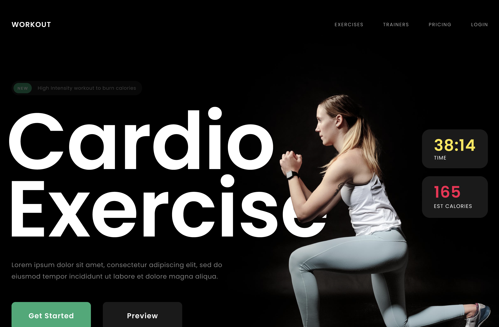

<!-- @format -->

# FIGMA DESIGN CLONE CODING! :muscle:

## 프로젝트 소개 :hatching_chick:

- 피트니스 랜딩 페이지입니다.
- Figma 디자인 클론코딩 프로젝트입니다. HTML과 CSS만 활용하여 구현하였습니다.
- [시안](https://www.figma.com/file/IcazX3KUiWW6TrfwnFqMpx/Fitness-Landing-Page-(Community)?type=design&node-id=0-1&mode=design&t=7jCaPpVd8fA9Hhz7-0)
- [주소](https://songsu218.github.io/sssemiProject1/)

## 개발기간 :hatched_chick:

- 2024.04.01(월)~2024.04.02(화)

## 개발자 소개 :baby_chick:

- **송성우**

## 1. 개발환경 :chicken:

- Front

 
- 디자인

## 2. 깨달은 점 :mag:

fixed는 뷰포트를 기준으로 배치하지만, 요소의 조상 중 하나가  
transform, perspective, filter none이 아닌 속성이라면 그 조상을 기준으로 삼습니다.

## 피드백
em 태그를 사용한 이유
em 대신 b를 사용하는 걸 고려
css * 사용하지 않기
클래스 이름 신중하게 주기
반복되는 요소 체크해서 줄이기
요소의 높이 넓이 물리적 단위보다는 상대단위 사용...
디자인 효과 주기

